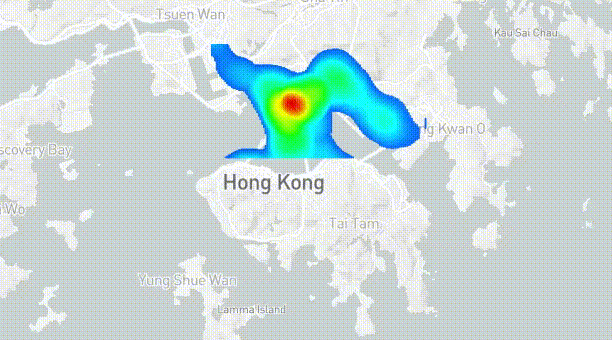

In this Github repository, we first show the code for the efficiency experiments in our paper. Then, we conduct two case studies for using time-evolving hotspot maps to understand hotspots. Lastly, we show the code for generating these time-evolving hotspot maps.

**(1) The code for the efficiency experiments in our paper**

In the "STKDV_Git_release.zip" file, it contains the shell script file "compile_and_run.sh". We can compile our code by running this script file. In addition, this script file describes each input variable in detail and provide an example for running our code. Unfortunately, the size of each dataset is large. Therefore, we only provide the code here. Nevertheless, all datasets that are used in our paper are publicly available, which can be found in the references of Table 3.

**(2) Case Studies**

We conduct two case studies, which are (2a) traffic accident hotspot detection in New York and (2b) COVID-19 hotspot detection in Hong Kong.

**(2a) Traffic accident hotspot detection in New York**

We show how we display STKDV as a time-evolving hotspot map in the New York traffic accident dataset [a], which contains nearly 1.5 million data points. Here, we adopt the 128x128x128 space-time cube for generating STKDV (i.e., the time-evolving hotspot map contains 128 timestamps) for the Upper Manhattan region in New York.

[a] NYC open data. https://data.cityofnewyork.us/Public-Safety/Motor-Vehicle-Collisions-Crashes/h9gi-nx95

In this figure, observe that the size of hotspots can change with respect to different timestamps.

**(2b) COVID-19 hotspot detection in Hong Kong**

We also display a time-evolving hotspot map in the Hong Kong COVID-19 dataset [b]. Here, we also use 128x128x128 space-time cube for generating STKDV.

[b] Hong Kong GeoData Store https://geodata.gov.hk/gs/view-dataset?uuid=d4ccd9be-3bc0-449b-bd27-9eb9b615f2db&sidx=0

In the first figure, it shows the distribution of the COVID-19 cases, starting from 13th February 2020 to 5th February 2021. This STKDV tool clearly shows different waves in Hong Kong and indicates that Kowloon is the hotspot of COVID-19 cases in Hong Kong.

In the second figure, it shows the distribution of the last wave of the COVID-19 cases (November 2020 to February 2021) in Kowloon. Observe that the hotspot changes from Mong Kok to Tsim Sha Tsui.

**(3) Reproducing the time-evolving hotspot maps**

The code for generating these time-evolving hotspot map can be found in the file "Time_evolving_hotspot_map_code_release.zip". To run our code, you need to follow these three steps.

1: Install node.js

2: Use cmd (in Windows) to access the directory "./Time_evolving_hotspot_map_code_release/Time_evolving_hotspot_map_code_release"

3: Type these two commands (1) npm install and (2) npm start

Since the size of these result files are large, we only provide the time-evolving hotspot map for Upper Manhattan (i.e., "New_York_Traffic_accidents.gif").
